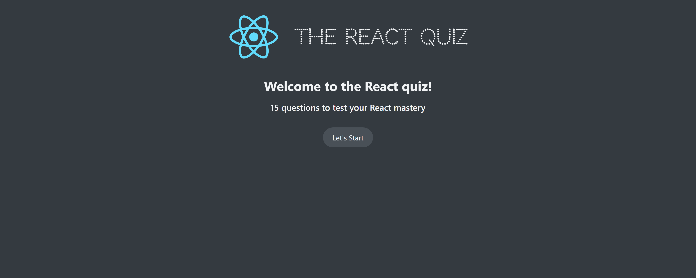
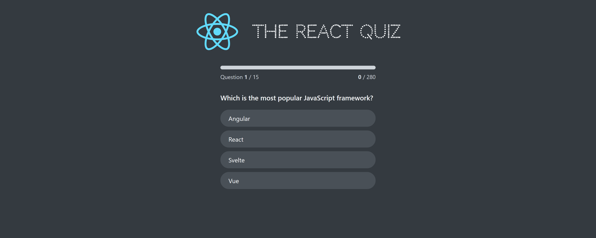
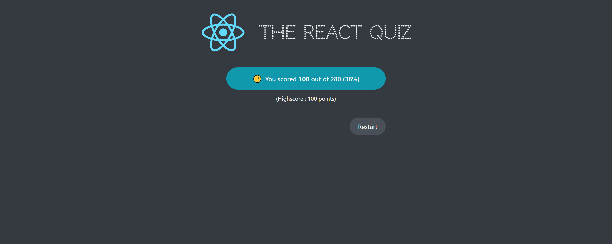

# React Quiz Website

This is a simple and interactive quiz application built using React. The app fetches quiz questions from an API, and users can answer questions to score points. The app keeps track of the user's high score and provides different screens depending on the state of the quiz.

## Features

- **Start Screen**: Displays the number of questions and allows the user to start the quiz.
- **Questions**: Presents questions with answer options, awarding points for correct answers.
- **Progress Tracking**: Shows current progress and scores.
- **Error and Loading Handling**: Displays loaders and error messages as necessary.
- **Finished Screen**: Summarizes the user's score and their high score.
- **Restart Quiz**: Option to restart the quiz and try again.

## Screenshots





## Installation

1. Clone the repository:

   ```
   git clone https://github.com/yourusername/react-quiz-website.git
   cd react-quiz-website
   ```

2. Install dependencies:

```
npm install
```

3. Start the development server:

```
npm start
```

4. Ensure the quiz API is running locally at http://localhost:8000/questions. You can adjust the API endpoint if needed.

## Project Structure

- **App.js**: Main application logic with `useReducer` for state management and `useEffect` to fetch quiz data.
- **Components**:
  - **Header**: Displays the app header.
  - **Main**: Wrapper for the main content.
  - **Loader** & **Error**: Show loading and error states.
  - **StartScreen**: Initial screen to start the quiz.
  - **Question**: Renders each question and answer options.
  - **NextQuestion**: Button for moving to the next question.
  - **Progress**: Displays the current progress, score, and max points.
  - **FinishedScreen**: Shows the final score and high score on completion.

## State Management

The app uses `useReducer` for state management with the following states:

- **loading**: Fetching data from the API.
- **ready**: Quiz ready to start.
- **active**: Quiz is ongoing.
- **finished**: Quiz completed.
- **error**: Error occurred during data fetching.

## API

The app expects the quiz questions API to be available at `http://localhost:8000/questions`. The questions should have the following structure:

```json
[
  {
    "question": "Sample question?",
    "options": ["Option 1", "Option 2", "Option 3", "Option 4"],
    "correctOption": 1,
    "points": 10
  }
]
```
